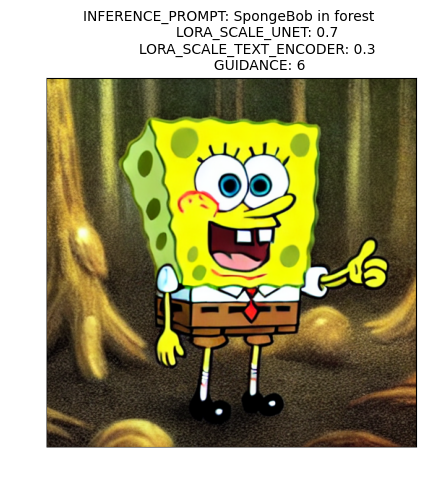
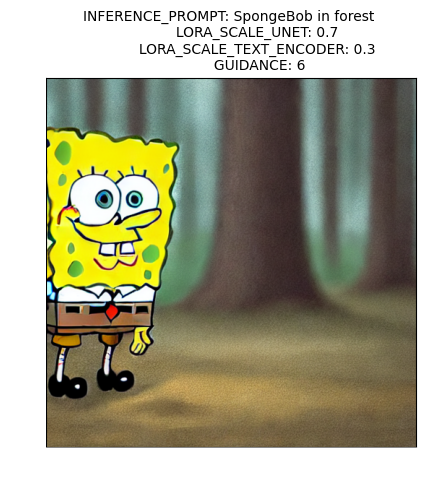
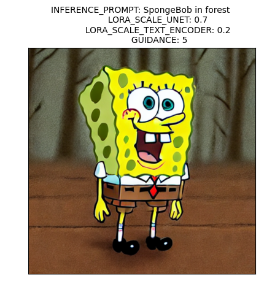

## TLab 2023. Domain-specific content generation

### Diffusion Models

####  What is it?

Diffusion Models refer to a class of generative models, meaning that they are used to generate data similar to the data which they were trained on. Fundamentally, Diffusion Models work by destroying training data through the successive addition of Gaussian noise and then learning to recover the data by reversing this noising process. After training, we can use the Diffusion Model to generate data by passing randomly sampled noise through the learned denoising process.

####  Application

One of the most well-known applications of diffusion models is the generation of images or videos based on their text description (Dall-E 2, Imagen, Stable Diffusion, Make-a-Video). In addition, there are applications related to the text-to-speech transformation, as well as the tasks of regression (prediction uncertainty estimation) and classification. Finally, diffusion models are actively used in natural sciences, for instance, in material science (material and molecular generation) and astrophysics (astronomical spectra generation, dark matter density modeling).

####  Problem statement

In concept, briefly and without any details, the process might be described using these equations according to the picture below.

<!--   -->

```math
 x_t = \sqrt{\alpha_t} x_{t-1} + \sqrt{1-\alpha_t} \epsilon_t ; \:\: \epsilon_t \sim \mathcal{N}(0,I)$$
```

```math
$$\hat{x}_{t-1} = \frac{1}{\sqrt{\alpha_t}} \left(x_t - \frac{1 - \alpha_t}{\sqrt{1 - \bar{\alpha_t}}} \epsilon_\Theta(x_t, t) \right) + \sigma_t z,$$  
```
where $`\bar{\alpha}_t = \prod\nolimits_{i=1}^t \alpha_t`$ ,  $`z \sim \mathcal{N}(0,I)`$
and $` \sigma_t = const.`$


 

So, the task of training the model is to minimize this loss:

 ```math
\mathcal{L}_t = \|x_{t-1} - \hat{x}_{t-1}\|_2 \propto \| \epsilon - \epsilon_\Theta(x_t, t)\|_2 \rightarrow \min_{\Theta} .
```


### [DreamBooth: Fine Tuning Text-to-Image Diffusion Models for Subject-Driven Generation](https://arxiv.org/abs/2208.12242) | Paper review

####   Main idea 

In this work, authors present a new approach for “personalization” of text-to-image diffusion models. Given just a few images of a subject as an input, they fine-tune a pretrained text-to-image model so it learns to bind a unique identifier with that specific subject. Once the subject is embedded in the output domain of the model, the unique identifier can be used to synthesize novel photorealistic images of the subject contextualized in different scenes.

####  Novelty

Compared to Image Composition techniques their approach enables generation of subjects in novel poses and new contexts. There also exist works on text-to-image synthesis such as Imagen, DALL-E2, Parti, CogView2, Stable Diffusion. They demonstrated unprecedented semantic generation. But these models do not provide fine-grained control over a generated image and use text guidance only. To sum up, for the first time both fidelity and new contexts were achieved in subject-driven generation.

 ####  Paper results

Authors of the article show experiments and applications, and the results are really impressive. They were able to preserve the unique visual features that give the subject its identity and essence. And it was observed that DreamBooth better preserves subject identity, and is more faithful to prompts.

### My examples of DreamBooth finetuning
I have finetuned model using SpongeBob images and searched for hyperparametres using grid search. Here are some examples with lr = 3e-4 and 1000 steps.






